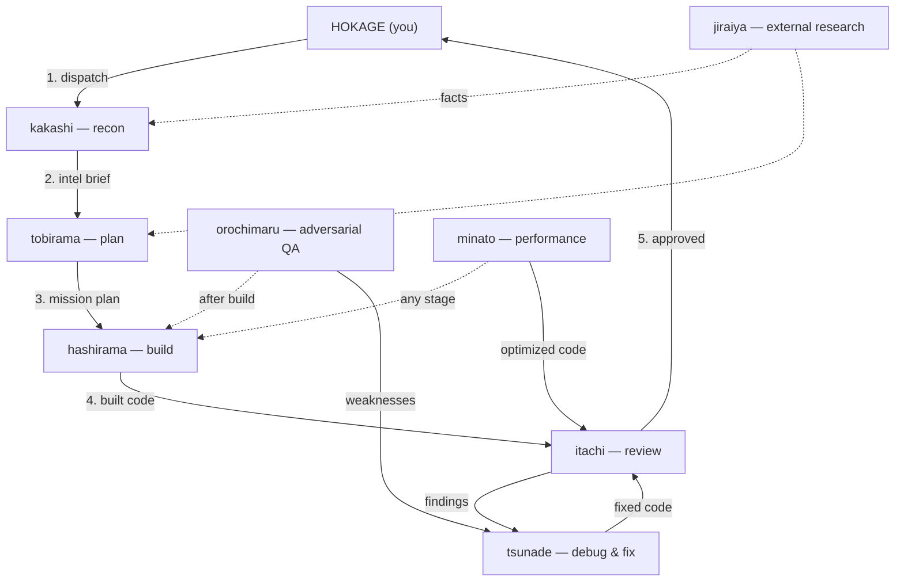

# Shinobi Roster — Agent Reference

The Hidden Leaf command structure for this workspace. 8 legendary shinobi (dispatched by you, the Hokage), each commanding a squad of max 2 jonin. Every report ends with **Next shinobi:** — a handoff recommendation; you always do the actual dispatch.

- Legendaries: `model: inherit` — full session capability.
- Jonin: `model: sonnet` — focused, cheaper strikes. Also directly dispatchable when one focused strike is enough.
- Squad limits: depth hard-capped at 2 (`CLAUDE_CODE_MAX_SUBAGENT_SPAWN_DEPTH` in `.claude/settings.json`); jonin have no `Agent` tool and can never spawn further.
- Definitions live in `.claude/agents/*.md`.

## The lifecycle flow

**How a mission runs:**

1. **kakashi** scouts the codebase and returns an intel brief.
2. **tobirama** turns the requirement into a refined, ordered mission plan.
3. **hashirama** builds it, tests green.
4. **itachi** reviews the result; **orochimaru** tries to break it.
5. **itachi** approves → back to you, the Hokage, to ship.

**Support shinobi, called when needed:**
- **jiraiya** — the answer lives outside the repo (libraries, APIs, upstream bugs).
- **tsunade** — itachi or orochimaru found something broken; she fixes it and returns it to review.
- **minato** — something is measurably slow; he optimizes with before/after numbers, then review.

Squads stay off this map — each legendary carries his own 2 jonin (see per-agent sections below).

---

## Legendaries

### kakashi — recon & intel briefings
- **Work:** Maps a target area end-to-end: entry points, data flow, conventions, gotchas — every claim cited `path:line`. Copies the codebase's existing patterns instead of inventing new ones.
- **In the flow:** First move on any mission. Produces the intel brief that tobirama plans from. Hands external-docs questions to jiraiya.
- **Handoffs:** → tobirama (intel ready to plan), → jiraiya (question leaves the repo).

### jiraiya — deep external research
- **Work:** Researches libraries, APIs, version compatibility, upstream bugs against primary sources (docs, changelogs, source). Checks versions against the repo's actual package files. Findings can be captured as a cited markdown file.
- **In the flow:** Any time the answer isn't in the village. Feeds verified facts into kakashi's briefs or tobirama's plans.
- **Handoffs:** → tobirama (research informs the plan), → kakashi (facts needed inside the repo).

### tobirama — requirements refinement & mission planning
- **Work:** Interrogates requirements until acceptance criteria are unambiguous, cuts scope that doesn't serve the goal, and produces ordered, file-exact mission plans executable without further questions.
- **In the flow:** After recon, before any build. The gate between "idea" and "mission".
- **Handoffs:** → hashirama (plan approved), → jiraiya (open question needs research).

### hashirama — feature implementation
- **Work:** Builds the plan: new features, modules, UI — in small vertical slices, matching existing conventions exactly. All tests green before reporting. Ponytail discipline: minimum code that works.
- **In the flow:** The build phase. Executes tobirama's missions; his output goes to itachi.
- **Handoffs:** → itachi (build done, review it), → tsunade (breaks found during build).

### tsunade — debugging & root-cause fixes
- **Work:** Reproduces, traces to the true root cause (never the first suspicious line), fixes with the minimal diff covering ALL callers, adds the regression test. No refactors bundled into fixes.
- **In the flow:** Whenever anything breaks — during build, after review findings, or on production smells.
- **Handoffs:** → itachi (fix needs review), → minato (the bug is a perf regression).

### itachi — code review & security
- **Work:** Reviews diffs on four axes: correctness, security (injection, authz gaps, trust boundaries between web and API), spec fidelity, maintainability. Ranked findings with failure scenarios; explicit about what was checked and is clean.
- **In the flow:** The quality gate after every build (and after tsunade's fixes). Verdicts: approve / approve-with-fixes / reject.
- **Handoffs:** → tsunade (findings need fixing), → hokage (approved, ship).

### orochimaru — adversarial QA & edge-case experiments
- **Work:** Designs and runs the experiments nobody else dares: hostile inputs, boundary values, concurrency, failure injection. Every discovered weakness becomes a passing test. No debris left behind.
- **In the flow:** After hashirama's build (alongside or after itachi) when confidence must be earned the hard way.
- **Handoffs:** → tsunade (weaknesses need fixes), → hashirama (tests demand implementation changes).

### minato — performance & resource optimization
- **Work:** Baseline measurement → dominant cost identified with evidence → smallest change that removes it → re-measure. Covers speed (latency, query plans, render cost) and weight (bundle size, memory, token/cost consumption). No optimization without before/after numbers; behavior preserved.
- **In the flow:** Any stage where something is measurably slow — API latency, bundle size, query plans, render cost.
- **Handoffs:** → tsunade (optimization exposed a bug), → itachi (change needs review).

---

## The 16 shinobi (directly dispatchable too)

Each shinobi serves one legendary but can be summoned directly by the Hokage for a single focused strike. Dispatch order inside each squad lives in the legendary agent files.

| Shinobi | Squad | Tools | Work |
|---|---|---|---|
| `neji` | kakashi | read-only | 360° structure sweeps: module map, layering, dependency direction, tangles. |
| `hinata` | kakashi | read-only | Gentle Fist lookups: exact usages, callers, definitions — cited or honestly "not found". |
| `konan` | jiraiya | read + web | Gathers raw sources (docs, changelogs, release notes, issues) with URLs and excerpts. No opinions. |
| `nagato` | jiraiya | read + web | Reconciles gathered sources into one verified answer with per-claim confidence; resolves conflicts. |
| `ino` | tobirama | read-only | Mind Transfer relay: compresses recon/research reports into a one-page, decision-ready brief. |
| `shikamaru` | tobirama | read-only | Drafts ordered task plans from refined requirements; finds the lazy path; flags open questions. |
| `yamato` | hashirama | full | Structural builds: new modules, interfaces, layer-spanning wiring — blueprint discipline. |
| `naruto` | hashirama | full | Volume builds: many similar pieces (endpoints, components, tests) ground out via one consistent pattern. |
| `shizune` | tsunade | full | Deterministic reproductions: exact steps, failing tests, logs — flakiness isolated to 100%. |
| `sakura` | tsunade | read-only | Root-cause diagnosis: evidence chain to the exact faulty line, plus blast radius of every caller. |
| `shisui` | itachi | read-only | Spec-fidelity review: every requirement implemented, nothing extra — gaps and additions reported separately. |
| `sasuke` | itachi | read-only | Security: injection, IDOR/authz gaps, input validation, secret leakage at web⇄API trust boundaries. |
| `kabuto` | orochimaru | full | Experiment design: adversarial test matrix; encodes every discovered weakness as a test. |
| `deidara` | orochimaru | full | Executes stress runs (load, chaos, hostile payloads); reports exactly what broke and why. Art is an explosion. |
| `rocklee` | minato | full | Benchmarks: baseline/after numbers with method, repeats, and variance. Honest numbers only. |
| `obito` | minato | read-only | Profile analysis: ranks costs from profiler/timing/bundle data, names the dominant one with attribution. |

## Skill wiring (quick reference)

| Shinobi | Superpowers | Mattpocock | Ponytail |
|---|---|---|---|
| kakashi | — | — (hands external work to jiraiya) | — |
| jiraiya | — | `research`, `grilling` | — |
| tobirama | `brainstorming`, `writing-plans` | `grill-with-docs`, `to-spec`, `to-tickets` | — |
| hashirama | `test-driven-development`, `executing-plans` | `implement`, `tdd`, `codebase-design` | always-on |
| tsunade | `systematic-debugging` | `diagnosing-bugs` | — |
| itachi | `verification-before-completion` | `code-review` | review lens |
| orochimaru | `test-driven-development` | `tdd`, `prototype` | — |
| minato | `systematic-debugging` | `diagnosing-bugs` | review lens |

Shinobi inherit their legendary's discipline; kabuto/naruto also carry TDD, shikamaru carries ponytail thinking. hashirama/naruto also carry `design-taste-frontend` (taste-skill) for UI builds.

## Dispatch guide — when to summon whom

**Pick by the question you're asking, not by habit:**

| Your situation | Dispatch |
|---|---|
| "How does X work in this repo?" / before any plan or build | **kakashi** |
| "Which library/version? What does this external API really do?" | **jiraiya** |
| "I have an idea — turn it into a spec and a plan" | **tobirama** |
| "Build this plan" | **hashirama** |
| "Something is broken / failing / flaky" | **tsunade** (→ shizune if vague, sakura for root cause) |
| "Review this before I merge" | **itachi** (+ orochimaru when the stakes are high) |
| "Try to break this" | **orochimaru** |
| "This is slow / heavy / expensive" | **minato** |

**Efficiency rules:**

1. **Don't skip recon.** kakashi → tobirama → hashirama → itachi is the quality chain; every skipped link is rework later. The only legitimate shortcut: tiny fixes go straight to **tsunade** or **hashirama** and then **itachi**.
2. **Dispatch a shinobi directly for a focused strike** (hinata for one lookup, sasuke for a security scan, rocklee for one benchmark) — cheaper than a full legendary pass.
3. **One mission, one shinobi.** Don't bundle "research AND plan AND build" into a single dispatch — each handoff gets a fresh-context agent and a **Next shinobi:** recommendation.
4. **Squads run inside their legendary** (jiraiya runs konan → nagato; you don't dispatch konan yourself unless you want raw gathering only).
5. **Read-only shinobi are cheap; legendaries are not.** For pure questions, kakashi/hinata/sakura cost a fraction of a hashirama build dispatch.
6. **Legendaries delegate volume, keep precision.** Each squad legendary is mandated to dispatch its squad for parallelizable/mechanical work and personally handle the judgment calls (diagnosis, verdicts, scope cuts, the core strike). If a legendary works solo on something big, re-dispatch with: *"delegate volume work to your squad; keep the precision work."*

## MCP tooling

MCP servers live in the workspace-root `.mcp.json` and are available to every agent:

| Server | Purpose | Primary users |
|---|---|---|
| `context7` | version-pinned current library docs | jiraiya, hashirama, tsunade |
| `playwright` | drive/verify the browser | hashirama, naruto, orochimaru, deidara |
| `chrome-devtools` | profiling, traces, low-token debugging | minato, obito, tsunade |
| `sqlite` | read-only data/schema inspection | kakashi, tsunade, sakura |
| `github` / `github-readonly` | GitHub's hosted MCP (OAuth via `/mcp`). The `-readonly` entry (`/readonly` URL) is server-enforced read-only — reviewer/planner agents get only that one | tobirama, itachi (readonly); hokage (full) |
| `firecrawl` | hosted deep web scrape/search/crawl (keyless free tier; add a Bearer key for crawl/map at scale) | konan, jiraiya |

The `sqlite` entry needs a per-project `--db-path`; add it in the target workspace's own `.mcp.json` rather than here.

Agents with a `tools:` allowlist in frontmatter can only call MCP servers listed there — grant with `mcp__<server>` (server-level, all tools) or the MCP line in their file is dead.

## CLI tooling

Installed system-wide (brew); not MCP — every agent reaches them through Bash.

| Tool | Purpose | Primary users |
|---|---|---|
| `bd` (beads) | git-backed mission/issue memory: `bd init && bd setup claude` per workspace. Mission plans, review findings, and fix tickets survive `/clear` and compaction. Workflow: `bd ready` → `bd update <id> --claim` → `bd close`. | hashirama (mission tasks → claim/close), tsunade (fix tickets), hokage |
| `rtk` | global PreToolUse hook that rewrites Bash calls (`git status` → `rtk git status`) and filters output before the LLM sees it. Minato's doctrine applied to the harness itself: token weight cut with zero behavior change. | everyone |
| `repomix` | packs a repo (local dir or `--remote owner/repo`) into one AI-readable file | jiraiya (external-repo research) |
